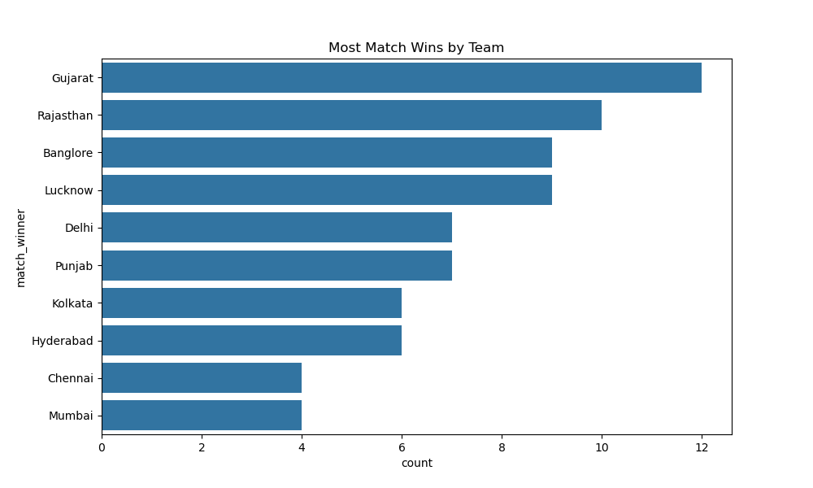
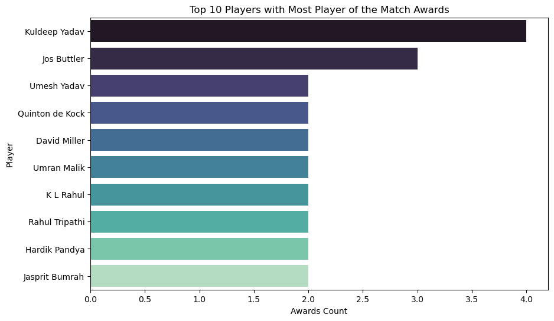
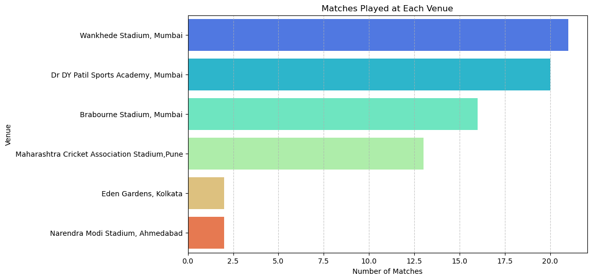
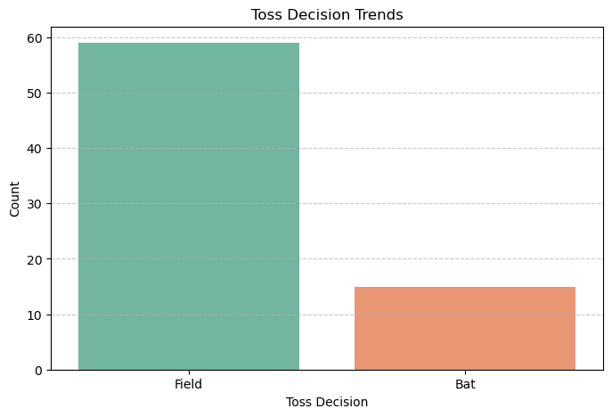

# IPL 2022 Data Analysis

## Project Overview
This project performs Exploratory Data Analysis (EDA) on the IPL 2022 dataset to uncover insights about team performance, match outcomes, and player achievements.

The analysis uses Python libraries such as Pandas, Matplotlib, and Seaborn to visualize key patterns in the tournament.

---

## Tools & Technologies
- Python
- Pandas
- Matplotlib
- Seaborn
- Jupyter Notebook

---

## Dataset Features
- Match Date
- Teams Playing
- Toss Winner and Decision
- Match Winner
- Player of the Match
- Venue
- Top Scorer
- Best Bowling Figures

---

## Visualizations

### Most Match Wins by Team

### Top 10 Players with Most Player of the Match Awards

### Matches Played by Venue

### Toss Decision Trends

---

## Key Insights

- Gujarat Titans won the highest number of matches.
- Kuldeep Yadav received the most Player of the Match awards.
- Wankhede Stadium hosted the highest number of matches.
- Most teams preferred **fielding first after winning the toss**.

---

## Conclusion

This analysis highlights important patterns in IPL 2022 matches, including team performance trends, player achievements, and match strategies. Data visualization helps in better understanding the dynamics of the tournament.

---
